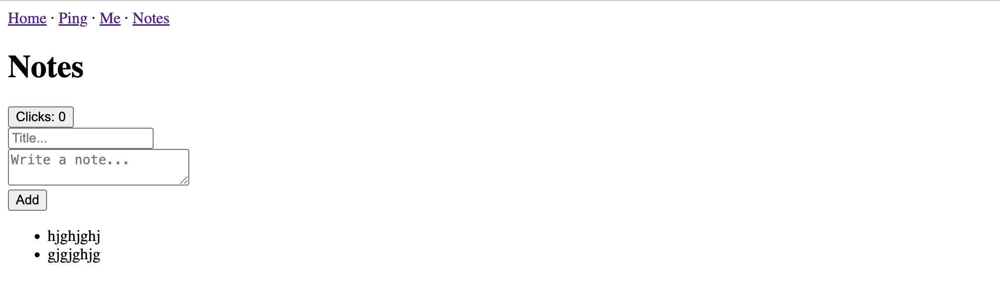

## Part 2 - Durable Objects
The first part of the tutorial dealt with the barebones basics of working with rwsdk: Route handling, React Server Components, Actions, Deploying to Cloudflare, Middleware and Context. This part gets spicy: Cloudflare Durable Objects. Everyone knows Prisma; here we’ll keep it basic with SQL. It’ll be fun.

### A quick lesson on Durable Objects

Normally, Cloudflare Workers don’t remember anything between requests — they run, return a response, and disappear. Durable Objects (DOs) are a way to give your Worker memory and identity.

We can think of a Durable Object as:
- A named instance of a class (e.g. "notes" or "chat-room-123").
- It always runs on Cloudflare’s edge, and we always connect to the same instance when we ask for that name.
- Each instance has its own built-in storage that saves data across requests.
- Requests to the same instance are handled one at a time, so we don’t need to worry about race conditions.
- While it’s “awake,” it can also hold in-memory state (like a list of WebSocket connections).

#### Why this is useful

Durable Objects are like tiny servers we don’t have to manage. They’re perfect for:
- Storing sessions or user data
- Counters or rate limits
- Chat rooms and presence lists
- Acting as a buffer in front of a database

In rwsdk, DOs fit naturally: our routes stay clean and server-first, while the DO looks after the state.

### 1. Define your Migrations

This describes the shape of the DO "database". We will be creating two tables. One for collecting users and another for saving notes.

```ts
// src/db/migrations.ts
import { type Migrations } from "rwsdk/db";

export const migrations = {
  "001_initial_schema": {
    async up(db) {
      return [

        await db.schema
          .createTable("users")
          .addColumn("id", "text", (col) => col.primaryKey())
          .addColumn("username", "text", (col) => col.notNull().unique())
          .addColumn("createdAt", "text", (col) => col.notNull())
          .execute(),

        await db.schema
          .createTable("notes")
          .addColumn("id", "text", (col) => col.primaryKey())
          .addColumn("userId", "text", (col) =>
            col.notNull().references("users.id").onDelete("cascade")
          )
          .addColumn("title", "text", (col) => col.notNull())
          .addColumn("content", "text")
          .execute(),
      ];
    },

    async down(db) {
      await db.schema.dropTable("notes").execute();
    },
  },
} satisfies Migrations;
```

### 2. Create your database instance

Now that we have described what our database should look like, it is time to create it.

```ts
// src/db/db.ts
import { env } from "cloudflare:workers";
import { type Database, createDb } from "rwsdk/db";
import { type migrations } from "@/db/migrations";

export type AppDatabase = Database<typeof migrations>;
export type User = AppDatabase["users"];
export type Note = AppDatabase["notes"];

export const db = createDb<AppDatabase>(
  env.APP_DURABLE_OBJECT as any,
  "main-database" // unique key for this database instance
);
```

### 3. Create Your Durable Object Class

Add the following to our `durableObject` file:

```ts
// src/db/durableObject.ts

import { SqliteDurableObject } from "rwsdk/db";
import { migrations } from "@/db/migrations";

export class AppDurableObject extends SqliteDurableObject {
  migrations = migrations;
}
```

### 4. Export the Durable Object from the worker

```ts
// src/worker.tsx
export { /* ... */ AppDurableObject } from "@/db/durableObject"

// ... rest of your worker code
```

### 5. Configure Wrangler

There will be some code inside your wrangler file, don't remove anything. Just slot the code below into the appropriate places.

```json
// wrangler.jsonc

{
  "durable_objects": {
    "bindings": [
      {
        "name": "APP_DURABLE_OBJECT",
        "class_name": "AppDurableObject"
      }
    ]
  },
  "migrations": [
    {
      "tag": "v1",
      "new_sqlite_classes": ["AppDurableObject"]
    }
  ]
}

```

### 6. Create action to fetch notes
We have been saving the notes to a store that gets wiped with each new session. It is time to hook up our Durable Object to display the notes in it. For now it will be empty, but thats okay. 

Let's start by creating a new action that fetches all notes by the current user.

```js
// src/app/notes/actions.ts    
import { db } from "@/db/db"; // Don'r forget to import 'db'

// ...

export const allNotes = (userId: string) => {
    return db
    .selectFrom("notes")
    .select([
        "notes.id",
        "notes.title",
        "notes.content"
    ])
    .where("notes.userId", "=", userId )
    .execute(); // execute returns a promise no need for extra "awaits" or "asyncs"
}

```

If you’ve written SQL before, the structure will feel familiar. The difference is that instead of writing one long query string, we build it step-by-step with small, type-safe functions — courtesy [Kysely](https://kysely.dev/). 

### 7. Update worker to send `user` data to NotesPage
The context is where the user data is stored and we need that for our action. Update the route inside the `defineApp` function to pass the user data to the NotesPage.

```js
// src/worker.tsx

route("/notes", ({ ctx }: { ctx: any }) => <NotesPage user={ctx.user} />),  

```

Now update the NotesPage to use the action to populate the list of notes using the context's `user.id` to filter the notes.
```js
// src/app/pages/NotesPage.tsx

import { postNotes, allNotes } from "@/app/notes/actions"; // import the allNotes action

// ...
export async function NotesPage({user}: {user:any}) {
  
  //const notes = allNotes;
    const notes = await allNotes(user.id)

  // ... rest of your code

```

### 8. Update the NotesPage form
Let's update the `NotesPage` form. When we look at the `notes` table on `src/db/migrations.ts`, we can see that we need:
- userId
- title
- content

The next step will show us how to populate `userId`. For now, let's add a `title` field and update the `text` input to a `content` textarea. 

```tsx
// src/app/pages/NotesPage.tsx

// ... rest of your code

<form action={postNotes}>
  <input name="title" required placeholder="Title..." /> <br/>
  <textarea name="content" required placeholder="Write a note..." /> <br/>
  <button type="submit">Add</button>
</form>

//...
```

Now our NotesPage should be free of all references to the `NOTES` store.

### 9. Update `postNotes` action

First, we need the current user from the server context. Because actions run on the server, we can read it from rwsdk’s [RequestInfo](https://docs.rwsdk.com/core/routing/#request-info) object. 

Then we can use the context in our `postNotes` action.

```js
// src/app/notes/actions.ts

import { requestInfo } from "rwsdk/worker";

// ...

export const postNotes = async (FormData: FormData) => {
    const form = FormData
    const {ctx} : { ctx: any } = requestInfo
    const userId = ctx.user.id

    // Get form data and sanitise
    const title = String(form.get("title") || "").trim();
    const content = String(form.get("content") || "").trim();

    // Validate
    if (title && content) {
        const note = {
            id: crypto.randomUUID(),
            userId: String(userId),
            title: String(form.get('title') || ""),
            content: String(form.get('content') || ""),
        };

        await db.insertInto("notes").values(note).execute();
    }
}

// ...

```

 Oops!!! That's embarrassing!!!

 ### 10. Add a quick check in route handling
 It seems we have no users in our `users` table. Lets add a check in the `defineApp` to check whether we have users and if not then to seed the users via actions.

 #### Create user actions

 Here 3 actions are created: `getAllUsers`, `seedUsers` and `hasUsers`

 ```js
 "use server";

import { requestInfo } from "rwsdk/worker";
import { db } from "@/db/db";


const seedUsers = async () => {
 // clean out the database
  await db.deleteFrom("users").execute();

  // set the initial sources
  // create some users
  await db
    .insertInto("users")
    .values([
      { id: "u_123", username: "John", createdAt: new Date().toISOString() },
      { id: "u_456", username: "Sue", createdAt: new Date().toISOString() },
      { id: "u_789", username: "Thandi", createdAt: new Date().toISOString() },
    ])
    .execute();

  console.log("🌱 Finished seeding");
}

const getAllUsers = () => {
  return db
    .selectFrom("users")
    .select([
      "users.id",
      "users.username",
      "users.createdAt"
    ])
    .execute(); // execute returns a promise no need for extra "awaits" or "asyncs"
}

const hasUsers = async () => {
    const users = await getAllUsers
    return users.length > 0
}

export { seedUsers, getAllUsers, hasUsers }
 ```

 #### Update worker to include user seeding
 Now that we have our actions, they need to be imported and used.

 ```js
 // ... Other code
 import { hasUsers, seedUsers } from "@/app/users/actions"

// ...

 let SEED_USERS = false; 

//...

 export default defineApp([
    // Global middleware run first
  sessionMiddleware,
  getUserMiddleware,
   async () => {
    if (!SEED_USERS) {
      const hasUsersResult = await hasUsers();
        if (!hasUsersResult) {
        await seedUsers();
      } 
      SEED_USERS = true
    }
    return; // continue request
  },
  render(Document, [
    route("/", () => <p>Home (public)</p>),
    route("/ping", () => <p>Pong (public)</p>),

    // Protected route demonstrates Interrupter short-circuit
    // You can pass the context to your response
    route("/me", [requireAuth, ({ ctx }: { ctx: any }) => <p>Hello {ctx.user.username} user page</p>]),
    route("/notes", ({ ctx }: { ctx: any }) => <NotesPage user={ctx.user} />), 
  ]),
]);
 ```
<!-- 
Uncomment once Justin fixes this script nonsense
### 10. Create a seed script
It seems we have no user in our `users` table. Let's create a seed script to add a few users.

#### Write the script
```js
// src/scripts/seed.ts
import { defineScript } from "rwsdk/worker";
import { db } from "@/db/db";

export default defineScript(async () => {
  // clean out the database
  await db.deleteFrom("users").execute();

  // set the initial sources
  // create some users
  await db
    .insertInto("users")
    .values([
      { id: "u_123", username: "John", createdAt: new Date().toISOString() },
      { id: "u_456", username: "Arun", createdAt: new Date().toISOString() },
      { id: "u_789", username: "Thandi", createdAt: new Date().toISOString() },
    ])
    .execute();

  console.log("🌱 Finished seeding");
});
```

#### Update `package.json` to run the script
```json
{
  // package.json
  "scripts": {
    "seed": "rw-scripts worker-run ./src/scripts/seed.ts"
    // ...
  }
}
```

#### Run it
```
npm run seed
``` -->
### 11. Deploy
All done! Now when you can try it out you should have a form that when submitted saves the results to a Durable Object. The results should be listed underneath the form.

Tada!



Let's deploy so that we can try this all out on Cloudflare

```
pnpm run release
```

Sometimes it takes a few hours for the DO to work on Cloudflare. So we might get an error at first but after a while it should work just fine.

### Next Steps
Now that you’ve added persistence with Durable Objects, try experimenting further.
You can use the [docs](https://docs.rwsdk.com/) to guide you:
- Add authentication using the Passkey Addon.
- Add realtime updates with Durable Objects + WebSockets so new notes broadcast instantly.
