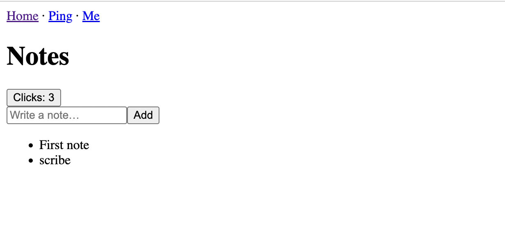
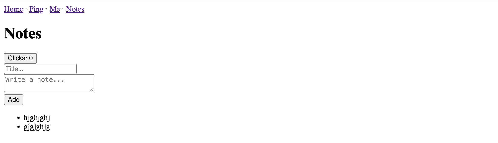

# rwsdk Tutorial - Ping Notes

This is a multi-part tutorial. The aim is to get you familiar with all the best parts of the rwsdk so that you can create an amazing app that saves the world. As this is being written theres no telling what this tutorial app will look like at the end of its journey... so stick around and find out. 

---
title: "rwsdk Tutorial – Part 1: Ping Notes"
summary: "Build your first rwsdk app — a simple notes demo that introduces routing, middleware, context, and server actions."
author: "Chris"
version: "rwsdk 1.0.0-beta.9"
last_tested: "2025-10-06"
difficulty: "Beginner"
time: "30 min"
tags:
  - cloudflare
  - rwsdk
  - react-server-components
  - tutorial
  - notes-app
series: "Ping Notes"
part: 1
next: "./part2.md"
repo: "https://github.com/yourname/ping-notes"
image: "./img01.png"
---

## Part 1

Let's start by building a quick notes app. Nothing fancy. This will give you the lay of the land when working with rwsdk.

Hopefully you will see rwsdk core beliefs in action:

- **Server-first by default.** Routes can return a classic Response or JSX that renders on the server (RSC) and streams to the client—no special folders needed.  
- **Explicit routing in one place.** You define routes in src/worker.tsx with route(...)—no file-system magic. Patterns support static/param/wildcard.  
- **Middleware + Context you control.** Populate ctx up front (e.g., session, user, db), and every route/action sees it. You can also add Interrupters per-route (mini middleware chains) to short-circuit flow (e.g., auth).  
- **Custom HTML shell per route.** Use render(Document, [...routes]) to pick the HTML “document” per set of routes; you own <html>, scripts, hydration strategy.  
- **Cloudflare-native.** Ships as a Vite plugin targeting Workers; deploy with one command; D1/R2/Queues/DOs are first-class.  

**Prerequisites**

You will need a few things before we get started: 

- [Node.js v22](https://nodejs.org/en/download/) or later
- [Cloudflare](https://www.cloudflare.com/en-gb/plans/) account
- Basic web development knowledge

### 1. Create a new app
```terminal 
  npx create-rwsdk ping-notes
  cd ping-notes
  pnpm install
  pnpm dev
```
Open http://localhost:5173 and you’ll see the starter. The entry is src/worker.tsx.

### 2. Your first two routes: Response vs JSX

Open `src/worker.tsx` and add a classic text route and a JSX route side by side:

```js
// src/worker.tsx
  import { defineApp } from "rwsdk/worker";
  import { route, render } from "rwsdk/router";
  import { Document } from "@/app/Document";

  export default defineApp([
    render(Document, [
      route("/", () => new Response("Hello, World!")),          // returns Response
      route("/ping", () => <h1>Pong!</h1>),                     // returns JSX (RSC)
    ]),
  ]);
```

Now visit / and /ping. Notice how routes are just functions—no API/filesystem coupling.  


### 3. Add middleware and context (session → user)

Let’s pretend we have a session middleware that populates ctx.session, then hydrate ctx.user for downstream routes. If unauthenticated, we’ll block with an Interrupter on a protected route.

```js
  // src/worker.tsx
  import { defineApp } from "rwsdk/worker";
  import { route, render } from "rwsdk/router";
  import { Document } from "@/app/Document";

  export { SessionDurableObject } from "@/session/durableObject"

  // Example "session" middleware
  async function sessionMiddleware({ ctx }: { ctx: any }) {
    // (In the standard starter, sessions are Durable-Object backed.)
    // For demo, fake a userId. Replace with your real session lookup.
    ctx.session = { userId: "u_123" };
  }

  // hydrate ctx.user from session
  async function getUserMiddleware({ ctx }: { ctx: any }) {
    if (ctx.session?.userId) {
      // Replace with your DB call
      ctx.user = { id: ctx.session.userId, username: "chris" };
    }
  }

  // Per-route Interrupter
  function requireAuth({ ctx }: { ctx: any }) {
    if (!ctx.user) return new Response("Unauthorized", { status: 401 });
  }

  export default defineApp([
    // Global middleware running first before routing
    sessionMiddleware,
    getUserMiddleware,

    render(Document, [
      route("/", () => <p>Home (public)</p>),
      route("/ping", () => <p>Pong (public)</p>),

      // Protected route demonstrates Interrupter short-circuit 
      // You can pass the context to your response
      route("/me", [requireAuth, ({ ctx }: { ctx: any }) => <p>Hello {ctx.user.username} user page</p>]),
    ]),
  ]);
```

Interrupters run before your handler for the **matched** route; returning a Response halts the chain. Middleware runs before routing and is where you shape ctx for the request.

### 4. Render through a custom Document (you own the HTML)

Let's take a look at our Document file that renders your app HTML shell. We are going to change it so that it shows the right title and add a little navigation to make moving between pages easier. Later you can create your own navigation component.

```js
// src/app/Document.tsx
export const Document: React.FC<{ children: React.ReactNode }> = ({
  children,
}) => (
  <html lang="en">
    <head>
      <meta charSet="utf-8" />
      <meta name="viewport" content="width=device-width, initial-scale=1" />
      <title>rwsdk tutorial - Ping Notes</title>
    </head>
    <body>
      <header><a href="/">Home</a> · <a href="/ping">Ping</a> · <a href="/me">Me</a> · <a href="/notes">Notes</a></header>
      <div id="root">{children}</div>
      <script>import("/src/client.tsx")</script>
    </body>
  </html>
);

```

### 5. A tiny “Notes” page: RSC data + a form POST

We’ll show a realistic, server-first flow: render notes and accept a form submission on the same route.

> Use D1 if you like — the binding guide is in [Database(D1)](https://docs.rwsdk.com/core/database/)—but to keep the tutorial copy-pastable, we’ll use an in-memory array. Swap the reads/writes for your D1 calls later. You can also try out the super experimental Durable Object guide. Live a little ;)

Create a demo store for notes in-memory array:

```ts
  // src/app/notes/store.ts (temporary demo storage)
  export const NOTES: { id: number; text: string }[] = [{ id: 1, text: "First note" }];
```

Create an action for processing form data:

```ts
// src/app/actions.ts
"use server";
import { NOTES } from "@/app/notes/store";

export const postNotes = (FormData: FormData) => {
    const form = FormData
    const text = String(form.get("text") || "").trim();
    if (text) {
        NOTES.push({ id: Date.now(), text });
    }
}
```

Create a Notes page for creating and rendering the notes from our store:

```ts
  // src/app/pages/NotesPage.tsx (server component)
  import { NOTES } from "../notes/store";
  import { postNotes } from "../notes/actions"; // import the action

  export async function NotesPage() {
    // Server component: fetch your data here (e.g., D1 query)
    const notes = NOTES;
    return (
      <>
        <h1>Notes</h1>
        <form action={postNotes}>
          <input name="text" placeholder="Write a note…" />
          <button type="submit">Add</button>
        </form>
        <ul>
          {notes.map((n) => <li key={n.id}>{n.text}</li>)}
        </ul>
      </>
    );
  }
```

Wire the route to render JSX:

```js
  // src/worker.tsx (add below your existing routes)
  import { NotesPage } from "@/app/pages/NotesPage";
  import { NOTES } from "@/app/notes/store";

  export default defineApp([
    sessionMiddleware,
    getUserMiddleware,

    render(Document, [
      // ...previous routes

      route("/notes", () => <NotesPage />),
    ]),
  ]);
```

**Protecting page and/or action (optional):**
- To **gate the page**, wrap with requireAuth Interrupter:
  ```ts
    route("/notes", [requireAuth, () => <NotesPage />]),
  ```
- To **gate the action**, add a check inside postNotes (replace with your real logic):
  ```ts
    // src/app/actions.ts
    "use server";

    import { NOTES } from "@/app/notes/store";

    function assertAuthed() {
      // TODO: replace with your project’s ctx/auth wiring for actions
      const isAuthed = true;
      if (!isAuthed) throw new Error("Unauthorized");
    }

    export const postNotes = (formData: FormData) => {
      assertAuthed();
      const text = String(formData.get("text") || "").trim();
      if (text) NOTES.push({ id: Date.now(), text });
    };
  ```
### 6. Add a tiny client island

If you need interactivity, mark a component with "use client", import it, and drop it into your server JSX.

Create a "client-side" component:
```ts
  // src/app/components/Counter.tsx
  "use client";

  import { useState } from "react";
  export default function Counter() {
    const [n, setN] = useState(0);
    return <button onClick={() => setN(v => v + 1)}>Clicks: {n}</button>;
  }
```
Import and use the new Counter component
```ts
// src/app/pages/NotesPage.tsx (use it)
import Counter from "@/app/components/Counter";
// ...
export async function NotesPage() {
  const notes = NOTES;
  return (
    <>
      <h1>Notes</h1>
      <Counter />
      <form action={postNotes}>
        <input name="text" placeholder="Write a note…" />
        <button type="submit">Add</button>
      </form>
      <ul>{notes.map((n) => <li key={n.id}>{n.text}</li>)}</ul>
    </>
  );
}
```

Keep most UI as **server components**; hydrate only the islands that need it.

### 7. Deploy when ready
If you followed the instructions you will be left with something that looks like this:



Time to deploy. Run the command below. This will open up Cloudflare in your browser to log in and grant permissions. Go back to your terminal when that's done.

```
  pnpm run release
```

### 8. Mental model (cheat-sheet)

- **One surface for pages & endpoints**: routes can return **JSX or Response** — mix as needed.
- **Forms prefer Server Actions**: ergonomic server mutations without wiring explicit POST branches.
- **Context you own**: ctx shaped in middleware; read in routes and actions.
- **Documents**: define your HTML wrapper per route group with render(Document, [...]).
- **Cloudflare-friendly**: deploys like a Worker; D1/DO integrate without ceremony.

### Next Steps

So now that you have the basics down you can try doing the following by yourself. You can use the [docs](https://docs.rwsdk.com/) to guide you:

- Replace the in-memory NOTES with D1 (bind DB in wrangler.jsonc, query in your server code).
- Add realtime with Durable Objects + WebSockets so new notes broadcast instantly.
- Split your app into multiple render(Document, [...]) clusters if you want different shells per section.

or you can move onto the next part of the tutorial... "Part 2 - Durable Objects"

---
title: "rwsdk Tutorial – Part 2: Durable Objects"
summary: "Add Durable Objects to your rwsdk app for persistent storage and in-memory state."
author: "Chris"
version: "rwsdk 1.0.0-beta.9"
last_tested: "2025-10-06"
difficulty: "Intermediate"
time: "45 min"
tags:
  - cloudflare
  - durable-objects
  - rwsdk
  - tutorial
repo: "https://github.com/yourname/ping-notes"
image: "./img02.png"
---

## Part 2 - Durable Objects
The first part of the tutorial dealt with the barebones basics of working with rwsdk: Route handling, React Server Components, Actions, Deploying to Cloudflare, Middleware and Context. This next part gets spicy: Cloudflare’s Durable Objects. Everyone knows Prisma, but let’s get basic with SQL. It’ll be fun.

### A quick lesson on Durable Objects

Normally, Cloudflare Workers don’t remember anything between requests — they run, return a response, and disappear. Durable Objects (DOs) are a way to give your Worker memory and identity.

You can think of a Durable Object as:
- A named instance of a class (e.g. "notes" or "chat-room-123").
- It always runs on Cloudflare’s edge, and you always connect to the same instance when you ask for that name.
- Each instance has its own built-in storage that saves data across requests.
- Requests to the same instance are handled one at a time, so you don’t need to worry about race conditions.
- While it’s “awake,” it can also hold in-memory state (like a list of WebSocket connections).

#### Why this is useful

Durable Objects are like tiny servers you don’t have to manage. They’re perfect for:
- Storing sessions or user data
- Counters or rate limits
- Chat rooms and presence lists
- Acting as a buffer in front of a database

In rwsdk, DOs fit naturally: your routes stay clean and server-first, while the DO looks after the state.

### Define your Migrations

This describes the shape of the DO "database". We will be creating two tables. One for collecting users and another for saving notes.

```ts
// src/db/migrations.ts
import { type Migrations } from "rwsdk/db";

export const migrations = {
  "001_initial_schema": {
    async up(db) {
      return [

        await db.schema
          .createTable("users")
          .addColumn("id", "text", (col) => col.primaryKey())
          .addColumn("username", "text", (col) => col.notNull().unique())
          .addColumn("createdAt", "text", (col) => col.notNull())
          .execute(),

        await db.schema
          .createTable("notes")
          .addColumn("id", "text", (col) => col.primaryKey())
          .addColumn("userId", "text", (col) =>
            col.notNull().references("users.id").onDelete("cascade")
          )
          .addColumn("title", "text", (col) => col.notNull())
          .addColumn("content", "text")
          .execute(),
      ];
    },

    async down(db) {
      await db.schema.dropTable("notes").execute();
    },
  },
} satisfies Migrations;
```

### 2. Create your database instance

Now that you have described what your database should look, it is time to create it.

```ts
// src/db/db.ts
import { env } from "cloudflare:workers";
import { type Database, createDb } from "rwsdk/db";
import { type migrations } from "@/db/migrations";

export type AppDatabase = Database<typeof migrations>;
export type User = AppDatabase["users"];
export type Post = AppDatabase["notes"];

export const db = createDb<AppDatabase>(
  env.APP_DURABLE_OBJECT as any,
  "main-database" // unique key for this database instance
);
```

### 3. Create Your Durable Object Class

Add the following to your `durableObject` file:

```ts
// src/db/durableObject.ts

import { SqliteDurableObject } from "rwsdk/db";
import { migrations } from "@/db/migrations";

export class AppDurableObject extends SqliteDurableObject {
  migrations = migrations;
}
```

### 4. Export the Durable Object from the worker

```ts
// src/worker.tsx
export { /* ... */ AppDurableObject } from "@/db/durableObject"

// ... rest of your worker code
```

### 5. Configure Wrangler

There will be some code inside your wrangler file, don't remove anything. Just slot the code below into the appropriate places.

```json
// wrangler.jsonc

{
  "durable_objects": {
    "bindings": [
      {
        "name": "APP_DURABLE_OBJECT",
        "class_name": "AppDurableObject"
      }
    ]
  },
  "migrations": [
    {
      "tag": "v1",
      "new_sqlite_classes": ["AppDurableObject"]
    }
  ]
}

```

### 6. Create action to fetch notes
We have been saving the notes to a store that gets wiped with each new session. It is time to hook up our Durable Object to display the notes in it. For now it will be empty, but thats okay. 

Let's start by creating a new action that fetches all notes by the current user.

```js
// src/app/notes/actions.ts    
import { db } from "@/db/db"; // Don'r forget to import 'db'

// ...

export const allNotes = (userId: string) => {
    return db
    .selectFrom("notes")
    .select([
        "notes.id",
        "notes.title",
        "notes.content"
    ])
    .where("notes.userId", "=", userId )
    .execute(); // execute returns a promise no need for extra "awaits" or "asyncs"
}

```

If you’ve written SQL before, the structure will feel familiar. The difference is that instead of writing one long query string, we build it step-by-step with small, type-safe functions — courtesy [Kysely](https://kysely.dev/). 

### 7. Update worker to send `user` data to NotesPage
The context is where the user data is stored and we need that for our action. Update the route inside the `defineApp` function to pass the user data to the NotesPage.

```js
// src/worker.tsx

route("/notes", ({ ctx }: { ctx: any }) => <NotesPage user={ctx.user} />),  

```

Now update the NotesPage to use the action to populate the list of notes using the context's `user.id` to filter the notes.
```js
// src/app/pages/NotesPage.tsx

import { postNotes, allNotes } from "../notes/actions"; // import the allNotes action

// ...
export async function NotesPage({user}: {user:any}) {
  
  //const notes = allNotes;
    const notes = await allNotes(user.id)

  // ... rest of your code

```

### 8. Update the NotesPage form
Let's update the `NotesPage` form. If we look at the `notes` table on `src/db/migrations.ts`, we can see that we need:
- userId
- title
- content

The next step will show you how to populate `userId`. For now, let's add a `title` field and update the `text` input to a `content` textarea. 

```tsx
// src/app/pages/NotesPage.tsx

// ... rest of your code

<form action={postNotes}>
  <input name="title" required placeholder="Title..." /> <br/>
  <textarea name="content" required placeholder="Write a note..." /> <br/>
  <button type="submit">Add</button>
</form>

//...
```

Now your NotesPage should be free of all references to the `NOTES` store.

### 9. Update `postNotes` action

First, we need the current user from the server context. Because actions run on the server, we can read it from rwsdk’s [RequestInfo](https://docs.rwsdk.com/core/routing/#request-info) object. 

Then we can use the context in our `postNotes` action.

```js
// src/app/notes/actions.ts

import { requestInfo } from "rwsdk/worker";

// ...

export const postNotes = async (FormData: FormData) => {
    const form = FormData
    const {ctx} : { ctx: any } = requestInfo
    const userId = ctx.user.id

    // Get form data and sanitise
    const title = String(form.get("title") || "").trim();
    const content = String(form.get("content") || "").trim();

    // Validate
    if (title && content) {
        const note = {
            id: crypto.randomUUID(),
            userId: String(userId),
            title: String(form.get('title') || ""),
            content: String(form.get('content') || ""),
        };
        console.log(note)
        await db.insertInto("notes").values(note).execute();
    }
}

// ...

```

 Oops!!! That's embarrassing!!!

 ### Add a quick check in route handling
 It seems we have no users in our `users` table. Lets add a check in the `defineApp` to check whether we have users and if not then to seed the users via actions.

 #### Create user actions

 Here 3 actions are created: `getAllUsers`, `seedUsers` and `hasUsers`

 ```js
 "use server";

import { requestInfo } from "rwsdk/worker";
import { db } from "@/db/db";


const seedUsers = async () => {
 // clean out the database
  await db.deleteFrom("users").execute();

  // set the initial sources
  // create some users
  await db
    .insertInto("users")
    .values([
      { id: "u_123", username: "John", createdAt: new Date().toISOString() },
      { id: "u_456", username: "Sue", createdAt: new Date().toISOString() },
      { id: "u_789", username: "Thandi", createdAt: new Date().toISOString() },
    ])
    .execute();

  console.log("🌱 Finished seeding");
}

const getAllUsers = () => {
  return db
    .selectFrom("users")
    .select([
      "users.id",
      "users.username",
      "users.createdAt"
    ])
    .execute(); // execute returns a promise no need for extra "awaits" or "asyncs"
}

const hasUsers = async () => {
    const users = await getAllUsers
    return users.length > 0
}

export { seedUsers, getAllUsers, hasUsers }
 ```

 #### Update worker to include user seeding
 Now that we have our actions, they need to be imported and used.

 ```js
 // ... Other code
 import { hasUsers, seedUsers } from "@/app/users/actions"

// ...

 let SEED_USERS = false; 

//...

 export default defineApp([
    // Global middleware run first
  sessionMiddleware,
  getUserMiddleware,
   async () => {
    if (!SEED_USERS) {
      const hasUsersResult = await hasUsers();
        if (!hasUsersResult) {
        seedUsers();
      } 
      SEED_USERS = true
    }
    return; // continue request
  },
  render(Document, [
    route("/", () => <p>Home (public)</p>),
    route("/ping", () => <p>Pong (public)</p>),

    // Protected route demonstrates Interrupter short-circuit
    // You can pass the context to your response
    route("/me", [requireAuth, ({ ctx }: { ctx: any }) => <p>Hello {ctx.user.username} user page</p>]),
    route("/notes", ({ ctx }: { ctx: any }) => <NotesPage user={ctx.user} />), 
  ]),
]);
 ```
<!-- 
Uncomment once Justin fixes this script nonsense
### 10. Create a seed script
It seems we have no user in our `users` table. Let's create a seed script to add a few users.

#### Write the script
```js
// src/scripts/seed.ts
import { defineScript } from "rwsdk/worker";
import { db } from "@/db/db";

export default defineScript(async () => {
  // clean out the database
  await db.deleteFrom("users").execute();

  // set the initial sources
  // create some users
  await db
    .insertInto("users")
    .values([
      { id: "u_123", username: "John", createdAt: new Date().toISOString() },
      { id: "u_456", username: "Arun", createdAt: new Date().toISOString() },
      { id: "u_789", username: "Thandi", createdAt: new Date().toISOString() },
    ])
    .execute();

  console.log("🌱 Finished seeding");
});
```

#### Update `package.json` to run the script
```json
{
  // package.json
  "scripts": {
    "seed": "rw-scripts worker-run ./src/scripts/seed.ts"
    // ...
  }
}
```

#### Run it
```
npm run seed
``` -->
### Deploy
All done! Now you can try it out you should have a form that when filled in saves the results to a Durable Object. 

Tada!



Let's deploy so that we can try this all out on Cloudflare

```
pnpm run release
```

Sometimes it takes a few hours for the DO to work on Cloudflare but yeah it'll show up.